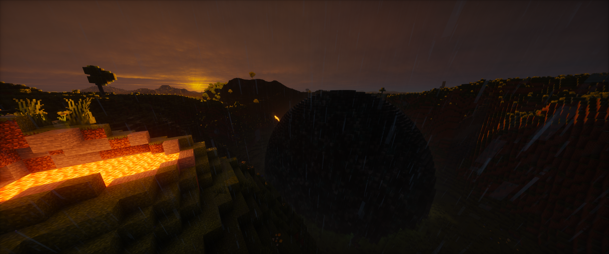
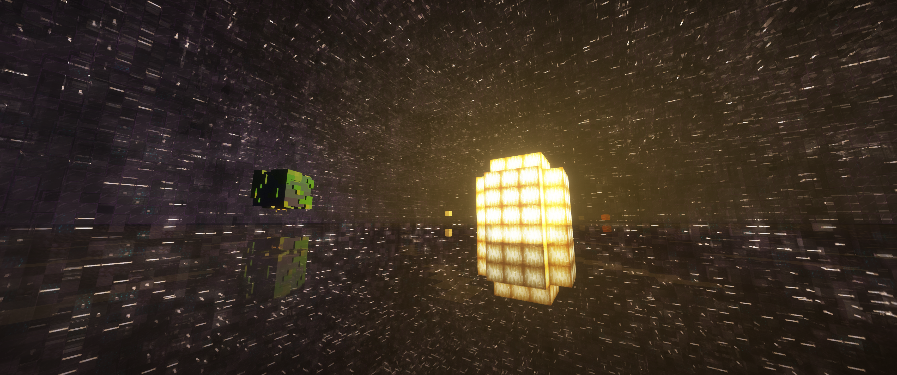

# Artefakt:
- **Talizman Talii (chuj wie co)** – _Speed II_ dla gracza noszącego
- **Kompas Rogiera (polaczone 4 kompasy w 1)** – _Step Height_ dla gracza noszącego
Po jednym dla każdej osoby w wygrywającej parze.
# Lore:
**Talia** była alchemiczką, eksperymentowała z magia i sie zamienila w rybe. Rogier był nawigatorem/korsarzem/marynarzem, który za wszelką cenę próbował ją odnaleźć.
## Talia
- Zamieniona w rybe Smarkula
- asdasd
- sdads
## Nawigator 
- Bezimienny do samego konca.
- Na finalnym artefakcie smaczek ze to tak naprawde byl rogier
- fasifhaosi
- faoshfoas????????
# Lokacje:
- **Okręt Rogiera** 
	`/execute in minecraft:overworld run tp @s 4741.06 69.68 2450.92 -172.16 57.26`
	
- **Domek Talii**
	`/execute in minecraft:overworld run tp @s 5401.77 70.06 3351.76 -1882.49 9.36`
	
- **Morski labirynt**
	`/execute in minecraft:overworld run tp @s 7430.89 -20.00 1915.67`
	
	
- **Strażnica morska**
	`/execute in minecraft:overworld run tp @s 4168.08 72.60 2775.46 -302.39 -13.66`
	
	
- Gwiazdoskłon
```java
/execute in minecraft:overworld run tp @s 1989.59 67.63 4276.34 -4768.59 68.06
```


# Etapy:
## Początek:
Przygoda zaczyna sie od znalezienia w jednej z osad notatki o ptzycumowanym ogrecie gdzies tam. Na okrecie da sie znalezc pierwszy kompas prowadzacy do smarkuli, oraz w skrzyni 2 notatki (1 szyfrem, druga czesciowo przetlumaczona). Zrobie to tak zeby dalo sie przy odrobinie pracy poskladac solucje do szyfru.
## Main Hub:
Domek Talii, przy łóżku ukryte zejscie do piwnicy gdzie znajduje sie smarkula i lista wyzwań, po ukonczeniu wszytstkich bedzie tam tez teleport/jakis pokoj finalowy gdzie dostaje sie artefakt od talii i zaklina kompas tez w artefakt idk.

## Wyzwania:
==TODO: napisaćplugin do obsługi kompasów, dodać interakcje co finalizuje dane wyzwanie==
JEBAĆ 4 ŻYWIOŁY, zachowujemy 4 etapy ale wszystkie związane bardziej z morzem (latarnia morska, kopuła z gwiazdami, labirynt morski, (?)). Do każdego wyzwania da się podchodzić w dowolnej kolejności. Tylko 1 para może robić dane wyzwanie na raz. Mechanizm failsafe, jak ktos blokuje wyzwanie na za długo to automatycznie otwiera następnej parze a tamtych kickuje. Zrobienie wszystkich 4 wyzwań jest wymagane do odblokowania finału.

1. [x] **Latarnia morska** (wyzwanie powietrza) - Wymagana jest 2 graczy, 1 oosoba musi aktywowac beacon zeby nawigator mogl wejsc na szczyt
2. [ ] **Morski labirynt** (wyzwanie wody)- teoretycznie da sie zrobic solo na razie, trzeba sie przekrasc przez ocean monument na niewidoku, pod nim jest labirytnt, jedna osoba idzie przez labirynt, druga prowadzi, w rogu jest ukryta mapa z solucja, ==TODO: Dodać pistony i ukryte przescia ktore sie otwieraja po wcisniecciu guziku, dodatkowo lepiej udekorowac bo szpetne so far==
3. [ ] **Układ słoneczny** (wyzwanie ziemi) - wielkie czarne pomieszczenie, w środku symulacja układu slonecznego (moze tylko slonce, ksiezyc, ziemia), jakiś redstone albo interakcje do kontrolowania uplywu czasu w symulacji, planuje zrobic tak zeby normalnie byla animacja jak planety plywaja wogol slonca, jakies notatki napisane szyfrem, które zawierają instrukcje jak operować symulacją układu, jak sie ustawi wszystkie w obiekty w jednej linii otwiera sie przejscie do pokoju z interakcją kończącą wyzwanie, ==TODO: Udekorowac z zewnatrz, przeroibc wejscie zeby bylo latwiejsze do znalezienia, dodaj tam zagadke, przyciski w dobrej kolejnosci bleble, planety ustawiaja sie w neuralnej pozycji==
4. [ ] cokolwiek xd
# Komendy:
*Efekty obsługiwane są przez plugin*
## Artefakty
- Artefakt 1:
```java
give WujekRadek rabbit_foot[custom_name=[{"text":"Talisman Talii","italic":false}],lore=[[{"text":"linijka 1","color":"aqua"}],[{"text":"linijka 2","color":"aqua"}],[{"text":"linijka 3","color":"aqua"}],[{"text":"linijka 4","color":"aqua"}],[{"text":"linijka 5","color":"aqua"}]]]
```
## Notatki dodatkowe
 - Notatka szyft - Wyzwanie Powietrza
```java
give WujekRadek paper[custom_name=[{"text":"Wyzwanie Powietrza","italic":false,"color":"gray","font":"minecraft:alt"}],rarity=rare]
```
- Notatka szyft - Wyzwanie Ognia
```java
give WujekRadek paper[custom_name=[{"text":"Wyzwanie Ognia","italic":false,"color":"red","font":"minecraft:alt"}],rarity=rare]
```
- Notatka szyft - Wyzwanie Ziemi
```java
give WujekRadek paper[custom_name=[{"text":"Wyzwanie Ziemi","italic":false,"color":"#92450c","font":"minecraft:alt"}],rarity=rare]
```
- Notatka szyft - Wyzwanie Wody
```java
give WujekRadek paper[custom_name=[{"text":"Wyzwanie Wody","italic":false,"color":"dark_aqua","font":"minecraft:alt"}],rarity=rare]
```
## Dodatkowe komendy
- dodawanie zone zeby po przybyciu na lokacje wyswietlila sie jej nazwa
```java
/zone add <nazwa> <lokacji> <itp> <ostatni argument - promień strefy>
/zone add Morski Labirynt 60
```
## Układ słoneczny
### Centrum układu
```java
/execute in minecraft:overworld run tp @s 1986.59 67.63 4276.34 -4768.59 68.06
```

### ~~Ustawienie scoreboardów do przchowywania danych o czasie i prędkości symulacji~~ SCRAPPED, zrobie to pluginem
~~
```java
/scoreboard objectives add orbit_time dummy
```
```java
/scoreboard objectives add orbit_speed dummy
```
```java
/scoreboard objectives add radius_mercury dummy
```
```java
/scoreboard objectives add radius_earth dummy
```
```java
/scoreboard objectives add radius_mars dummy
```
```java
/scoreboard objectives add radius_moon dummy
```
```java
/scoreboard objectives add cos_val dummy
```
```java
/scoreboard objectives add sin_val dummy
```

```java
/scoreboard players set global orbit_time 0
```
```java
/scoreboard players set global orbit_speed 1
```
```java
/scoreboard players set mercury radius_mercury 6
```
```java
/scoreboard players set earth radius_earth 10
```
```java
/scoreboard players set mars radius_mars 15
```
```java
/scoreboard players set moon radius_moon 2
```
~~

### Przyzywanie słońca, planet i księżyca
```java
/summon armor_stand ~ ~ ~ {NoGravity:1b,Invisible:1b,Marker:1b,Tags:["sun_center"]}
```
```java
execute at @e[type=armor_stand,tag=sun_center,limit=1] run summon armor_stand ~ ~ ~6 {NoGravity:1b,Invisible:1b,Marker:1b,CustomName:'"Mercury"',Tags:["planet","mercury"]}
```
```java
execute at @e[type=armor_stand,tag=sun_center,limit=1] run summon armor_stand ~ ~ ~10 {NoGravity:1b,Invisible:1b,Marker:1b,CustomName:'"Earth"',Tags:["planet","earth"]}
```
```java
execute at @e[type=armor_stand,tag=sun_center,limit=1] run summon armor_stand ~ ~ ~15 {NoGravity:1b,Invisible:1b,Marker:1b,CustomName:'"Mars"',Tags:["planet","mars"]}
```
```java
execute as @e[tag=earth,limit=1] at @s run summon armor_stand ~ ~ ~2 {NoGravity:1b,Invisible:1b,Marker:1b,CustomName:'"Moon"',Tags:["moon"]}
```
### Dodanie głów armor standom tak zeby wygladaly jak planety
```java
item replace entity @e[tag=mercury,limit=1] armor.head with minecraft:player_head[minecraft:custom_name={"text":"Mercury","color":"gold","underlined":true,"bold":true,"italic":false},profile={properties:[{name:"textures",value:"eyJ0ZXh0dXJlcyI6eyJTS0lOIjp7InVybCI6Imh0dHA6Ly90ZXh0dXJlcy5taW5lY3JhZnQubmV0L3RleHR1cmUvOTdmYjI3YTFhMTFiYTQ1NmMwYTEzZjkwOTAxMzY0Y2VkOWVjYWQ4ZmU5Yzk5YjY4MzhmZjVmNGRhYjFmNjE5MSJ9fX0="}]}]
```
```java
item replace entity @e[tag=earth,limit=1] armor.head with minecraft:player_head[minecraft:custom_name={"text":"Ziemia","color":"gold","underlined":true,"bold":true,"italic":false},profile={properties:[{name:"textures",value:"eyJ0ZXh0dXJlcyI6eyJTS0lOIjp7InVybCI6Imh0dHA6Ly90ZXh0dXJlcy5taW5lY3JhZnQubmV0L3RleHR1cmUvNTU3N2M0ZGUxZjUxYTcwNzIyMDIzZTg1NmI1NDNjZDU3MGYxZDBlZTZiOWQxNjdiNTkwMjhjZTFiYzkyZTQ1OCJ9fX0="}]}]
```
```java
item replace entity @e[tag=mars,limit=1] armor.head with minecraft:player_head[minecraft:custom_name={"text":"Mars","color":"gold","underlined":true,"bold":true,"italic":false},profile={properties:[{name:"textures",value:"eyJ0ZXh0dXJlcyI6eyJTS0lOIjp7InVybCI6Imh0dHA6Ly90ZXh0dXJlcy5taW5lY3JhZnQubmV0L3RleHR1cmUvNzc3ZDYxNmJjNDRhYzliMzczMGZlZDQ3ZjI5YTM3OGY4OGExNjcyOGM2NzA0OGMxYTM4N2QyMjllMWNiYSJ9fX0="}]}]
```
```java
item replace entity @e[tag=moon,limit=1] armor.head with minecraft:player_head[minecraft:custom_name={"text":"Moon","color":"gold","underlined":true,"bold":true,"italic":false},profile={properties:[{name:"textures",value:"eyJ0ZXh0dXJlcyI6eyJTS0lOIjp7InVybCI6Imh0dHA6Ly90ZXh0dXJlcy5taW5lY3JhZnQubmV0L3RleHR1cmUvNDRjODUzMmQ2ZmUxNGM1YjEzYzdjOTZhN2U5YjViODQ0Y2M5YmI2OTU5ODg5NDA3MDk5OGY1YmQzMmMyNGUzNSJ9fX0="}]}]
```

### ~~Command Blocki~~ scrapped, zrobie to pluginem bedzie szybciej i wydajniej
